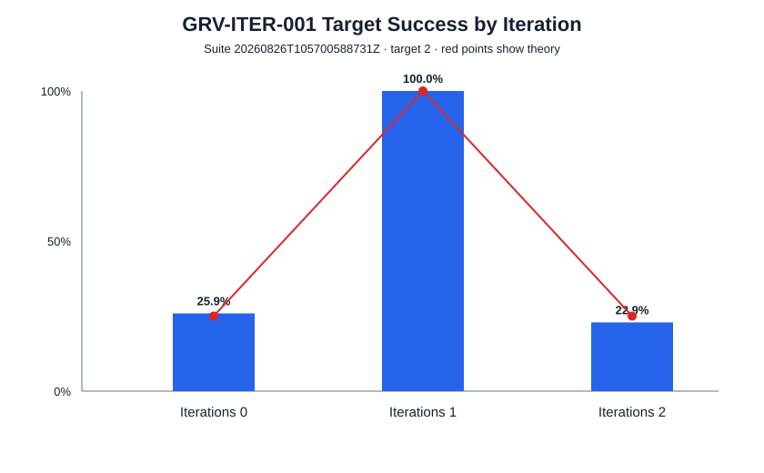

# Quantum Programming Onboarding with Q# — Grover Search

This repository contains a simulator-based quantum programming onboarding project built with Microsoft Q# and the Quantum Development Kit (QDK).

The project starts with small Q# exercises for measurement, superposition, randomness, and entanglement, then develops a complete two-qubit implementation of Grover search over four candidates. The final algorithm is tested component-by-component and evaluated with repeated simulator experiments whose raw outcomes, processed summaries, and figures are included in the repository.

> **Scope:** all reported results use the local ideal QDK simulator. This repository does not claim physical-hardware validation or quantum speedup from simulator runtime.

## Project at a glance

The Grover mini-project uses:

- **4 candidates**
- **2 search qubits**
- **1 marked target**
- **1 Grover iteration** for the ideal four-candidate baseline
- a parameterized phase oracle
- an explicit diffusion operator
- deterministic component and end-to-end tests
- repeated simulator experiments with retained shot-level evidence

The logical encoding is:

```text
q0 = logical MSB
q1 = logical LSB

0 -> |00>
1 -> |01>
2 -> |10>
3 -> |11>
```

The production entry point is:

```text
Grover.RunGroverSearch(target, iterations)
```

## Repository structure

```text
src/
├── learning/          Introductory Q# exercises
└── grover/            Grover search implementation

tests/qsharp/          Dedicated Q# test project
experiments/           Simulator experiment runners

results/
├── raw/               Preserved shot-level outcomes
├── processed/         Summaries derived from raw results
└── figures/           Figures generated from measured data

docs/
├── learning/          Learning summary
├── design/            Grover design
├── experiments/       Experiment definitions and results
└── report/            Final technical report
```

## Learning exercises

The introductory Q# examples are intentionally small and focused:

- `HelloQuantum.qs` — qubit allocation, Hadamard, measurement, and reset
- `RandomBit.qs` — a simulator-based random-bit exercise
- `SuperpositionDemo.qs` — superposition and the `H² = I` round trip
- `EntanglementDemo.qs` — Bell-state preparation with `H` + `CNOT`

A concise explanation of the concepts used in the project is provided in [`docs/learning/learning_summary.md`](docs/learning/learning_summary.md).

## Grover design

The production flow is:

```text
allocate |00>
      ↓
prepare uniform superposition
      ↓
apply target phase oracle
      ↓
apply diffusion
      ↓
measure + decode + reset
      ↓
return candidate 0..3
```

The implementation is split into five Q# operations:

- `PrepareUniformSuperposition`
- `ApplyOracle`
- `ApplyDiffusion`
- `MeasureResult`
- `RunGroverSearch`

The oracle marks the selected logical basis state by phase rather than by returning the answer classically. The diffuser is implemented explicitly as:

```text
H H -> X X -> CZ -> X X -> H H
```

The full design, mapping, oracle construction, diffuser convention, and testing approach are documented in [`docs/design/grover_design.md`](docs/design/grover_design.md).

## Requirements

The accepted project environment was validated with:

- Python **3.11.13**
- `qdk==1.31.0`
- `qsharp==1.31.0`
- macOS on Apple Silicon

Other supported environments may also work, but they were not part of the recorded project run.

## Setup

Create a fresh Python 3.11 environment from the repository root:

```bash
python3.11 -m venv .venv
source .venv/bin/activate
python -m pip install -r requirements.txt
```

## Run Grover search

From the repository root:

```bash
python - <<'PY'
from qdk import qsharp

qsharp.init(project_root=".")

target = 2
results = qsharp.run(
    f"Grover.RunGroverSearch({target}, 1)",
    shots=10,
)

print([int(result) for result in results])
PY
```

For the ideal four-candidate problem, one Grover iteration has theoretical target probability 1.

## Run the Q# tests

The dedicated test project checks state preparation, oracle phase behavior, diffusion phase behavior, measurement mapping, and the complete search.

```bash
python - <<'PY'
from qdk import qsharp

qsharp.init(project_root="tests/qsharp")

tests = [
    ("StatePreparationTests.RunReversibleCheck()", "state preparation"),
    ("OracleTests.RunPhaseMatrix()", "oracle phase matrix"),
    ("DiffusionTests.RunEigenphaseChecks()", "diffusion eigenphases"),
    ("MeasurementTests.RunMappingChecks()", "measurement mapping"),
    ("GroverTests.RunBaselineTargets()", "Grover baseline"),
]

for callable_name, label in tests:
    result = qsharp.run(callable_name, shots=1)
    assert len(result) == 1, (label, result)
    assert bool(result[0]) is True, (label, result)
    print(f"{label}: PASS")
PY
```

The oracle and diffuser tests are deliberately phase-sensitive. A computational-basis measurement alone cannot reveal an isolated sign change, so the tests use controlled interference with a probe qubit to convert the relevant eigenphase into a deterministic measurement result.

## Experiment results

### Random-bit checkpoint

The random-bit exercise was repeated for 1,000 simulator shots.

| Outcome | Count | Rate |
| --- | ---: | ---: |
| Zero | 510 | 51.0% |
| One | 490 | 49.0% |

The predeclared acceptance interval was 45%–55% for each outcome.

### Grover baseline

For target `2`, one iteration, and 1,000 shots:

| Outcome | Count |
| --- | ---: |
| 0 | 0 |
| 1 | 0 |
| **2** | **1,000** |
| 3 | 0 |

Measured target success: **100.0%**.

### Target-change experiment

The same parameterized oracle was tested with every target using one Grover iteration:

| Target | Correct / shots | Success |
| ---: | ---: | ---: |
| 0 | 250 / 250 | 100.0% |
| 1 | 250 / 250 | 100.0% |
| 2 | 250 / 250 | 100.0% |
| 3 | 250 / 250 | 100.0% |

### Iteration-count experiment

For target `2`, the success behavior was measured at zero, one, and two Grover iterations:

| Iterations | Outcome counts `[0,1,2,3]` | Target success | Theory |
| ---: | --- | ---: | ---: |
| 0 | `[234, 263, 259, 244]` | 25.9% | 25% |
| 1 | `[0, 0, 1000, 0]` | 100.0% | 100% |
| 2 | `[261, 245, 229, 265]` | 22.9% | 25% |

This illustrates a key Grover-search idea: applying more iterations does **not** monotonically improve success. For this four-candidate case, one iteration reaches the optimum; a second iteration rotates the state past that optimum.



The complete experiment definitions, acceptance rules, observations, and interpretation are summarized in [`docs/experiments/experiment_results.md`](docs/experiments/experiment_results.md).

## Preserved evidence

The repository includes the accepted experiment artifacts:

```text
results/raw/
results/processed/
results/figures/
```

Raw JSON files retain individual simulator outcomes. Processed files are derived from those raw outcomes, and the SVG figures are generated from the measured summaries.

The preserved raw metadata retains the experiment configuration and environment details. Development-repository commit identifiers are omitted from this public submission.

The included experiment runners can be used for small smoke runs outside the repository. They should not be used merely to overwrite the preserved accepted evidence.

Example:

```bash
python experiments/grover_experiments.py \
  --mode smoke \
  --output-root /tmp/qsharp-grover-smoke \
  --allow-dirty
```

## Documentation

- [Learning Summary](docs/learning/learning_summary.md)
- [Grover Search Design](docs/design/grover_design.md)
- [Experiment Results](docs/experiments/experiment_results.md)
- [Final Technical Report](docs/report/Final_Report.pdf)

## Limitations

This project intentionally stays small and simulator-focused:

- exactly two production search qubits;
- exactly four candidates;
- one marked target;
- local ideal simulation only;
- no hardware execution;
- no noise model;
- no resource-estimation study;
- no quantum-error-correction implementation;
- no claim of quantum advantage based on simulator timing.

These constraints keep the onboarding project focused on understanding Q# fundamentals, interference, phase marking, amplitude amplification, testing, and interpretation of simulator results.
