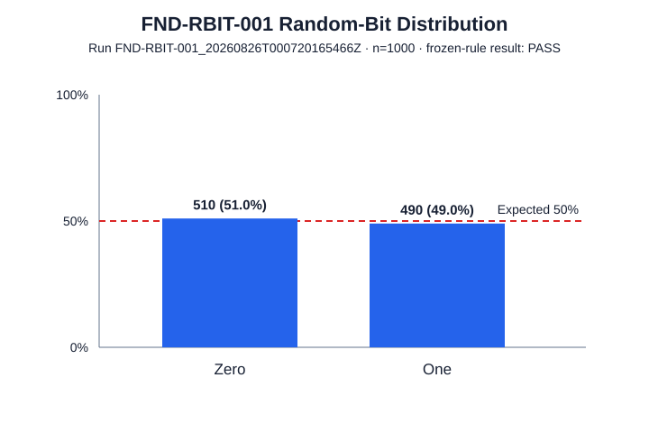
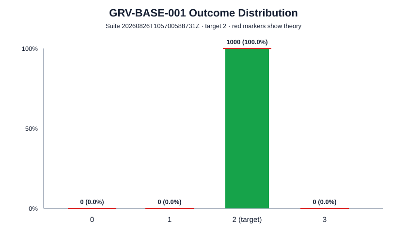
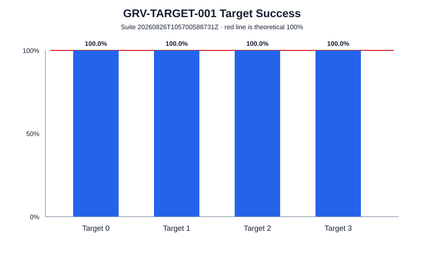

**Microsoft Q# Quantum Programming Onboarding — Final Technical Report**  
**Project:** Two-Qubit Grover Search on the Local QDK Simulator  
**Author:** Ömer Faruk Balaban  
**Date:** August 2026

# Project Overview

This onboarding project was designed to build practical familiarity with quantum-computing fundamentals and Microsoft Q# through a small, simulator-based implementation project.

The work began with focused Q# exercises covering qubit allocation, measurement, superposition, repeated sampling, and entanglement. Those concepts were then combined in a two-qubit implementation of Grover search over four candidates.

The final search problem is intentionally small:

```text
Candidates:          0, 1, 2, 3
Search qubits:       2
Marked targets:      1
Production ancillas: 0
Ideal baseline:      1 Grover iteration
```

The logical encoding is:

| Candidate | Basis state |
| ---: | :---: |
| 0 | `|00>` |
| 1 | `|01>` |
| 2 | `|10>` |
| 3 | `|11>` |

with:

```text
q0 = logical most-significant bit
q1 = logical least-significant bit
```

The main production callable is:

```text
Grover.RunGroverSearch(target, iterations)
```

The final repository contains:

- introductory Q# learning exercises;
- a parameterized two-qubit Grover implementation;
- component and end-to-end Q# tests;
- repeated simulator experiments;
- retained raw shot-level results;
- processed summaries and figures;
- design, learning, experiment, and project documentation.

All reported execution results use the local ideal QDK simulator. The project does not claim validation on physical quantum hardware and does not use simulator runtime as evidence of quantum speedup.

## Deliverable structure

The main implementation is divided into:

```text
StatePreparation.qs
Oracle.qs
Diffusion.qs
Measurement.qs
GroverSearch.qs
```

The algorithm flow is:

```text
|00>
  ↓
H ⊗ H
  ↓
uniform superposition
  ↓
target phase oracle
  ↓
diffusion
  ↓
measurement + decoding
  ↓
candidate 0..3
```

The supporting documents in the submission provide additional detail:

- `docs/learning/learning_summary.md`
- `docs/design/grover_design.md`
- `docs/experiments/experiment_results.md`

# Learning Achievements

The learning phase focused on quantum concepts that could be exercised directly in Q# rather than treated only as definitions.

## Qubits, basis states, and amplitudes

A qubit is described by amplitudes:

\[
|\psi\rangle = \alpha|0\rangle + \beta|1\rangle,
\]

with normalization:

\[
|\alpha|^2 + |\beta|^2 = 1.
\]

For two qubits, the computational basis contains four states:

```text
|00>  |01>  |10>  |11>
```

This becomes the natural four-candidate search space for the final project.

Measurement probabilities are determined by squared amplitude magnitudes. A single measurement produces one classical outcome, so repeated simulator shots are needed to observe the underlying distribution.

## Superposition

Applying the Hadamard gate to `|0⟩` prepares:

\[
H|0\rangle
=
\frac{|0\rangle + |1\rangle}{\sqrt{2}}.
\]

Applying Hadamard to both search qubits prepares:

\[
\frac{|00\rangle + |01\rangle + |10\rangle + |11\rangle}{2},
\]

which gives every Grover candidate equal initial amplitude.

The learning exercises also verified the reversible identity:

\[
H^2 = I.
\]

This reinforces that quantum gates transform amplitudes coherently rather than acting as classical random instructions.

## Phase and interference

The most important conceptual transition for the Grover project was understanding that phase can matter even when immediate measurement probabilities do not change.

The states:

\[
\frac{|0\rangle + |1\rangle}{\sqrt{2}}
\]

and

\[
\frac{|0\rangle - |1\rangle}{\sqrt{2}}
\]

have the same immediate computational-basis probabilities, but they behave differently when amplitudes are recombined.

Grover search uses exactly this idea:

1. create a uniform superposition;
2. introduce a relative phase change on the target;
3. use diffusion to create constructive/destructive interference;
4. amplify the target amplitude;
5. measure the result.

This establishes an important distinction: superposition creates coherent alternatives, while phase and interference determine how those alternatives later reinforce or cancel.

## Controlled operations and entanglement

The learning exercises used `H` followed by `CNOT` to prepare the Bell state:

\[
\frac{|00\rangle + |11\rangle}{\sqrt{2}}.
\]

This demonstrated that a controlled operation can produce a joint multi-qubit state that cannot be described as two independent single-qubit states.

The Bell-state exercise also provided practice with multi-qubit measurement and correlation.

## Q# programming model

The project provided practical experience with:

- `operation` and `function`;
- `use` for qubit allocation;
- gate application;
- `MResetZ` for measurement plus reset;
- `Adjoint` and `Controlled` functors;
- classical parameters and control flow around quantum operations;
- safe qubit lifecycle management;
- Python-hosted execution through QDK.

Four small learning programs captured these ideas:

| File | Primary concept |
| --- | --- |
| `HelloQuantum.qs` | allocation, Hadamard, measurement, reset |
| `RandomBit.qs` | equal superposition and repeated sampling |
| `SuperpositionDemo.qs` | superposition and `H² = I` |
| `EntanglementDemo.qs` | Bell-state preparation using `H` + `CNOT` |

These exercises served as preparation for the final Grover implementation.

# Methodology

The project followed a component-first approach: understand the required quantum transformation, implement it as a small Q# operation, test the transformation at the correct level, and only then compose the complete search.

## State preparation

The search register starts in:

```text
|00>
```

and the operation:

```qsharp
PrepareUniformSuperposition(searchQubits)
```

applies Hadamard to both search qubits:

\[
H^{\otimes 2}|00\rangle
=
\frac{|00\rangle+|01\rangle+|10\rangle+|11\rangle}{2}.
\]

This prepares equal amplitude across all four candidates.

## Parameterized oracle

The oracle interface is:

```qsharp
ApplyOracle(searchQubits, target)
```

and implements phase marking:

\[
O_t|x\rangle =
\begin{cases}
-|x\rangle & x=t,\\
|x\rangle & x\neq t.
\end{cases}
\]

The implementation does not return the target classically and does not measure the search register.

A controlled-Z operation naturally phase-marks `|11>`, so the selected target is temporarily normalized to `|11>` using X gates:

| Target | Target state | X gates before CZ |
| ---: | :---: | --- |
| 0 | `|00>` | `X(q0), X(q1)` |
| 1 | `|01>` | `X(q0)` |
| 2 | `|10>` | `X(q1)` |
| 3 | `|11>` | none |

The X operations are then undone, leaving only the target phase change.

## Diffusion

The diffuser is implemented explicitly as:

```text
H H
X X
CZ
X X
H H
```

This implementation realizes:

\[
D = I - 2|s\rangle\langle s|,
\]

which differs from the common textbook expression

\[
2|s\rangle\langle s| - I
\]

by an overall global phase.

That difference does not affect computational-basis measurement probabilities in the uncontrolled production circuit, but it is relevant to a controlled phase-sensitive component test.

## Measurement and decoding

The measurement operation owns both decoding and reset.

The mapping is:

```text
|00> -> 0
|01> -> 1
|10> -> 2
|11> -> 3
```

or equivalently:

\[
value = 2 \cdot bit(q0) + bit(q1).
\]

Reset occurs during measurement so the two allocated search qubits are safely released.

## Testing methodology

The component tests were designed around quantum behavior rather than only final output.

### State preparation

State preparation is tested reversibly:

```text
|00>
  ↓ Prepare
|s>
  ↓ Adjoint Prepare
|00>
```

The final state must return exactly to `|00>`.

### Oracle phase test

A direct computational-basis measurement cannot distinguish `|x>` from `-|x>`, so it would be insufficient for testing a phase oracle.

The oracle test therefore uses a test-only probe qubit in superposition. A controlled oracle converts the marked-state eigenphase into a relative phase on the probe branch; a final Hadamard converts that phase into a deterministic measurement result.

The full matrix covers:

```text
4 targets × 4 candidate states = 16 deterministic cases
```

### Diffusion phase test

The diffuser is tested on states with known eigenphases, including the uniform state and an orthogonal state. A controlled probe makes the chosen phase convention observable.

### Measurement test

All four computational-basis states are prepared and decoded independently to protect the logical bit-order convention.

### End-to-end test

The complete search is tested for all four targets with one Grover iteration.

The final delivery validation also executed 100 host shots per target, requiring all 400 returned values to match the requested target on the ideal simulator.

## Experiment methodology

The final simulator study used predeclared configurations and acceptance rules.

The random-bit checkpoint retained 1,000 individual measurement outcomes.

The Grover suite retained 5,000 individual outcomes across:

- a baseline experiment;
- a target-change experiment;
- an iteration-count experiment.

Raw shot-level JSON was preserved. Processed summaries were derived from raw evidence, and SVG figures were generated from the measured summaries.

The detailed experiment evidence is available in `docs/experiments/experiment_results.md`.

# Testing & Results

## Random-bit checkpoint

The random-bit operation prepares `H|0⟩` and measures the result.

The theoretical distribution is:

```text
Zero = 50%
One  = 50%
```

The accepted run used 1,000 shots:

| Outcome | Count | Rate |
| --- | ---: | ---: |
| Zero | 510 | 51.0% |
| One | 490 | 49.0% |

The predeclared acceptance interval was 45%–55% for each outcome.

Result:

```text
PASS
```



The finite-sample result is close to, but not exactly equal to, the theoretical 50/50 distribution.

## Component and algorithm tests

The dedicated Q# test project verifies:

| Test | Purpose | Result |
| --- | --- | :---: |
| reversible state preparation | prepare + adjoint returns `|00>` | PASS |
| 16-case oracle phase matrix | correct marked-state phase | PASS |
| diffusion eigenphase checks | reflection and phase convention | PASS |
| measurement mapping | `00/01/10/11 -> 0/1/2/3` | PASS |
| full baseline targets | one-iteration Grover for all targets | PASS |

The final host validation additionally required:

```text
target 0 -> 100 / 100 exact
target 1 -> 100 / 100 exact
target 2 -> 100 / 100 exact
target 3 -> 100 / 100 exact
```

on the ideal simulator.

## Grover baseline experiment

Configuration:

```text
target = 2
iterations = 1
shots = 1000
```

Measured result:

| Outcome | Count | Rate |
| ---: | ---: | ---: |
| 0 | 0 | 0.0% |
| 1 | 0 | 0.0% |
| **2** | **1000** | **100.0%** |
| 3 | 0 | 0.0% |

Theoretical target probability:

```text
100%
```

Measured target probability:

```text
100%
```

Result:

```text
PASS
```



## Target-change experiment

The same parameterized oracle was executed for all four targets:

| Target | Correct / shots | Success |
| ---: | ---: | ---: |
| 0 | 250 / 250 | 100.0% |
| 1 | 250 / 250 | 100.0% |
| 2 | 250 / 250 | 100.0% |
| 3 | 250 / 250 | 100.0% |

Result:

```text
PASS
```

This confirms that the oracle logic changes behavior through the target parameter rather than through four separate hard-coded implementations.



## Iteration-count experiment

For four candidates and one marked target:

\[
\sin(\theta)=\frac12,
\qquad
\theta=\frac{\pi}{6},
\]

and:

\[
P_{\text{target}}(k)
=
\sin^2((2k+1)\theta).
\]

Therefore:

```text
k=0 -> 25%
k=1 -> 100%
k=2 -> 25%
```

The measured target results were:

| Iterations | Outcome counts `[0,1,2,3]` | Target rate | Theory |
| ---: | --- | ---: | ---: |
| 0 | `[234,263,259,244]` | 25.9% | 25% |
| 1 | `[0,0,1000,0]` | 100.0% | 100% |
| 2 | `[261,245,229,265]` | 22.9% | 25% |

For `k=0` and `k=2`, every candidate rate remained inside the frozen finite-sample interval of 20%–30%.

For `k=1`, all 1,000 outcomes were the target.

Result:

```text
PASS
```


The experiment shows that Grover iterations are not monotonically beneficial. One iteration is optimal for this fixed four-candidate problem; the second rotates the state past the optimum.

## Result interpretation

The observed simulator behavior is consistent with the expected ideal theory:

```text
random-bit superposition:
about 50% / 50%

Grover target probability:
about 25% -> 100% -> about 25%
```

The deterministic and stochastic results should be interpreted differently:

- component and ideal one-iteration correctness checks were treated as exact;
- finite-sample uniform distributions were allowed to fluctuate around their theoretical probabilities.

No result in this report should be interpreted as evidence of physical-device fidelity or quantum speedup based on wall-clock simulator runtime.

# Challenges & Solutions

## Challenge 1 — testing phase rather than only measurement outcomes

A phase oracle can be wrong even when direct computational-basis measurements appear unchanged.

For example:

```text
|x>
```

and:

```text
-|x>
```

have identical computational-basis measurement probabilities.

**Solution:** use a controlled-interference probe so that the oracle eigenphase becomes a measurable relative phase. This allowed all 16 target/candidate combinations to be tested deterministically.

The same principle was applied to the diffusion operator.

## Challenge 2 — preserving logical bit order

With two qubits it is easy to create ambiguity between simulator display order and the intended classical integer encoding.

**Solution:** define the project mapping explicitly:

```text
q0 = MSB
q1 = LSB
value = 2*q0 + q1
```

and protect it with dedicated measurement-mapping tests and target-change experiments.

## Challenge 3 — diffuser phase convention

The explicit diffuser implementation differs from the common textbook diffuser by a global `-1` phase.

In the normal production circuit, this does not change measurement probabilities. In a controlled component test, however, that phase becomes relative and observable.

**Solution:** document the chosen convention and test its eigenphase directly rather than treating the two matrix conventions as identical in every context.

## Challenge 4 — distinguishing exact behavior from sampling noise

Some configurations are deterministic on the ideal simulator, while others represent finite-sample measurements of a uniform distribution.

Using one acceptance style for both would either weaken exact correctness or demand impossible exact frequency equality from random samples.

**Solution:** use exact acceptance for deterministic configurations and predeclared finite-sample bands for stochastic configurations.

This kept the interpretation tied to the expected quantum behavior instead of adjusting thresholds after seeing the data.

# Next Steps

Stage 1 intentionally stops at a small, simulator-focused Grover implementation. The completed repository provides a stable foundation for further work, but the following items are not part of the submitted implementation.

## 1. Generalize the search size

A natural extension would replace the fixed two-qubit search register with a parameterized register and study how oracle construction, iteration count, and test strategy scale with problem size.

This would require a more general oracle interface rather than simply extending the current target-normalization table.

## 2. Compare additional iteration counts and search sizes

The current experiment demonstrates the `25% -> 100% -> 25%` pattern for `N=4`.

A broader study could compare measured simulator behavior with the general approximation:

\[
k_{\mathrm{opt}}
\approx
\left\lfloor
\frac{\pi}{4}\sqrt{\frac{N}{M}}
\right\rfloor
\]

for different search-space sizes `N` and marked-state counts `M`.

## 3. Introduce noise as a separate experiment layer

The current results deliberately use an ideal simulator.

A later extension could investigate how phase, diffusion, and final measurement success change under explicit noise assumptions, while keeping those results clearly separated from the ideal baseline.

## 4. Explore hardware-oriented constraints

If execution on physical quantum hardware becomes part of a later phase, the project could study:

- connectivity constraints;
- compilation/transpilation overhead;
- gate depth;
- readout error;
- repeated-shot stability.

These would be new experimental questions rather than reinterpretations of the current simulator results.

## 5. Optional neutral-atom exploration

A separate future stage could investigate how the logical search problem might be represented in a neutral-atom simulation environment.

That work would be treated as an independent extension and would not modify the completed Stage 1 Q# baseline.

The main outcome of Stage 1 is therefore a complete learning-to-implementation path: quantum fundamentals were exercised in Q#, combined into a working Grover search, tested with phase-sensitive methods, evaluated through repeated simulator runs, and documented with preserved evidence and explicit limitations.
